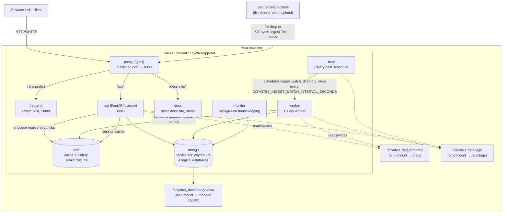
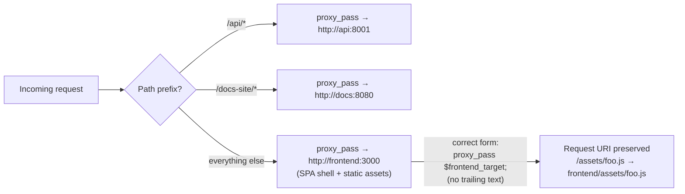
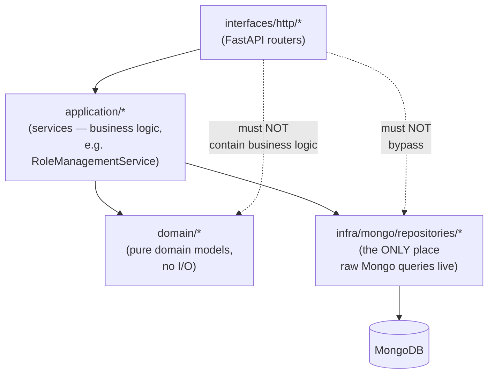
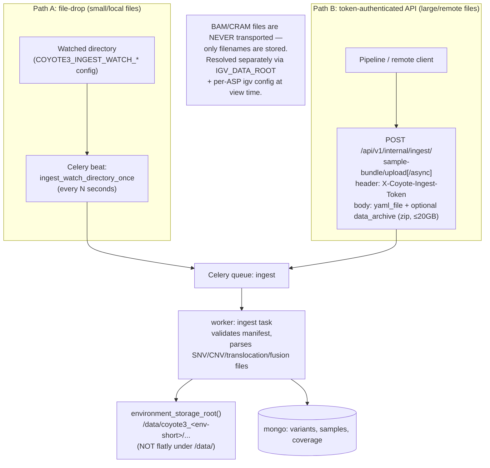
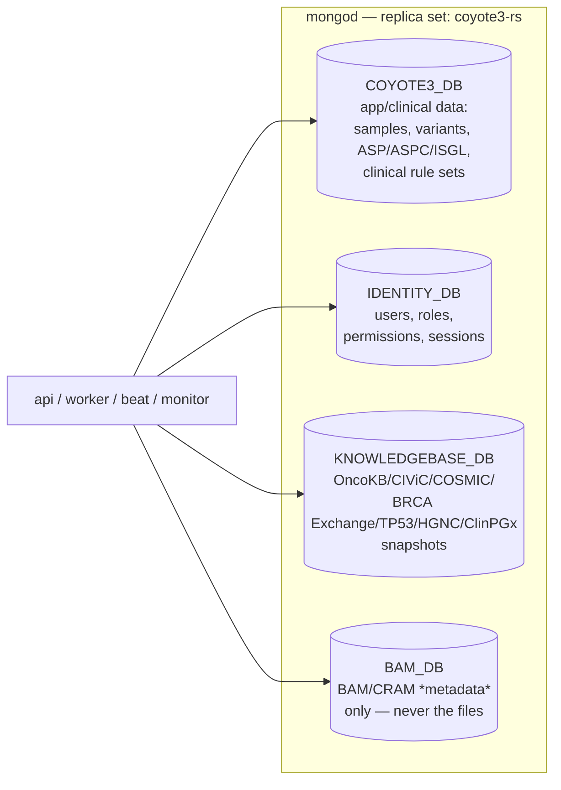
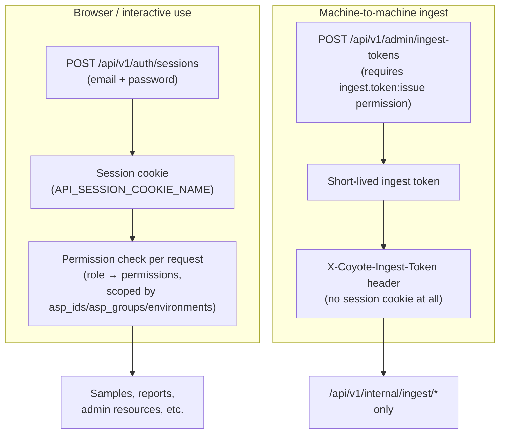

# Coyote3 Architecture — Diagrammatic Overview

Visual sketches of what's actually running under the hood, grounded in what
we verified hands-on while standing up the pilot (container topology,
network routing, ingest paths, RBAC behavior) rather than just the product
docs. Pair this with `docs/architecture/` (upstream's own architecture
docs, more exhaustive) and `docs/deployment_notes_saile.md` (how we
confirmed each of these paths actually works in practice).

---

## 1. Deployment topology — containers, network, and data

What `docker compose up` actually brings up, and where each container's
persistent state lives on the host. Everything inside the dashed box talks
over one internal Docker network (`COYOTE3_APP_NETWORK`); only `proxy` is
exposed to the outside.

Key points this diagram captures, each confirmed during the pilot:

- **`proxy` is the only externally-reachable container.** Everything else
  is only reachable over the internal Docker network — `frontend`, `api`,
  `docs`, `redis`, `mongo` have no published host ports in a normal setup
  (the pilot only mapped Mongo's port temporarily, to `27018`, for
  host-side bootstrap scripting — the application containers never need
  that).
- **`api`, `worker`, `beat`, and `monitor` all run from the same image**
  (`coyote3-api`), just with different entrypoint commands — they're one
  codebase running in four different process roles, not four separate
  builds.
- **All persistent state is on host bind mounts**, not Docker-managed
  volumes — this is why the pilot's later Docker-daemon migration
  (`docs/docker_issue.md`) needed zero data migration for Coyote3 itself,
  only for the unrelated `omixia` stack which did use named volumes.

## 2. Request routing inside nginx (`proxy`)

The one real bug we found (`docs/internal/known_issues.md` KI-001) lived
entirely in this layer, so it's worth sketching explicitly.

`render-config.sh` generates this config at container start from a
template, branching on whether `SCRIPT_NAME` (a URL path prefix, e.g.
`/coyote3`) is set — the pilot ran with none. Note that a `proxy_pass`
target built from a variable with **any literal text after it** (e.g. a
trailing `/`) stops nginx from substituting the request URI at all — this
is what KI-001 was.

## 3. Backend request flow — layering inside `api`

The architectural boundary AGENTS.md enforces, confirmed by
`tests/integration/test_api_architecture_boundaries.py`:

Routers never talk to Mongo directly and never embed business logic —
everything routes through a service in `application/`, which is the only
layer allowed to call into `infra/mongo/repositories/`. This is also why
the admin-resource API contract (`{"form_data": {...}}` wrapper — deployment
notes §14) lives at the service layer and is consistent across every
admin-resource endpoint (roles, ASP, ASPC, ISGL).

## 4. Ingest — the two transport paths, one processing pipeline

Both paths were exercised end-to-end during the pilot (deployment notes
§11–§12) and converge on the same ingest processing logic once a manifest
is accepted.

The detail that actually cost debugging time in the pilot: ingest storage
paths are namespaced by `ENV_NAME` via `environment_storage_root()`
(`api/config/paths.py`) — e.g. `/data/coyote3_stage/copied_sample_files/...`,
not flatly under `/data/`. Both transport paths land in the same place
once accepted.

## 5. MongoDB — one shared `mongod`, four logical databases

The pilot's topology choice (single shared `mongod` for all four logical
databases, rather than split instances):

Auth uses `keyFile`-based internal replica-set authentication plus a
dedicated `coyote3_app` application user. The replica set exists even
though there's a single member — Coyote3's driver-level behavior (retry
writes, `MONGO_READ_CONCERN_LEVEL`/`MONGO_WRITE_CONCERN_W=majority`, etc.)
assumes replica-set semantics. This is also the source of the one host-side
gotcha: bootstrapping from the host shell needs `directConnection=true`,
since the replica set advertises its Docker-internal hostname
(`mongo:27017`), unresolvable from outside the network — the application
containers use the full `replicaSet=` URI correctly and never hit this.

## 6. Auth — two independent credential mechanisms

The two mechanisms are completely independent — an ingest token grants
*no* access to anything outside the ingest endpoints, and a session cookie
is never accepted there either. Worth remembering: a role like `sys_admin`
can be fully valid and highly privileged operationally (can manage
users/roles/system config) while having **zero** visibility into clinical
sample data — that's deliberate RBAC scoping, not a bug (this looked like
one during the pilot until we checked `asp_ids`/`asp_groups` in the login
response).

---

Nothing above is aspirational — every arrow and behavior here was directly
observed while standing up and testing the pilot (curl traces, container
logs, kernel audit logs, or direct code reading), not just read off the
product docs. If a future upstream sync changes any of this, this document
is what's most likely to go stale first — re-verify against
`docs/architecture/` and the actual running containers before trusting it.
